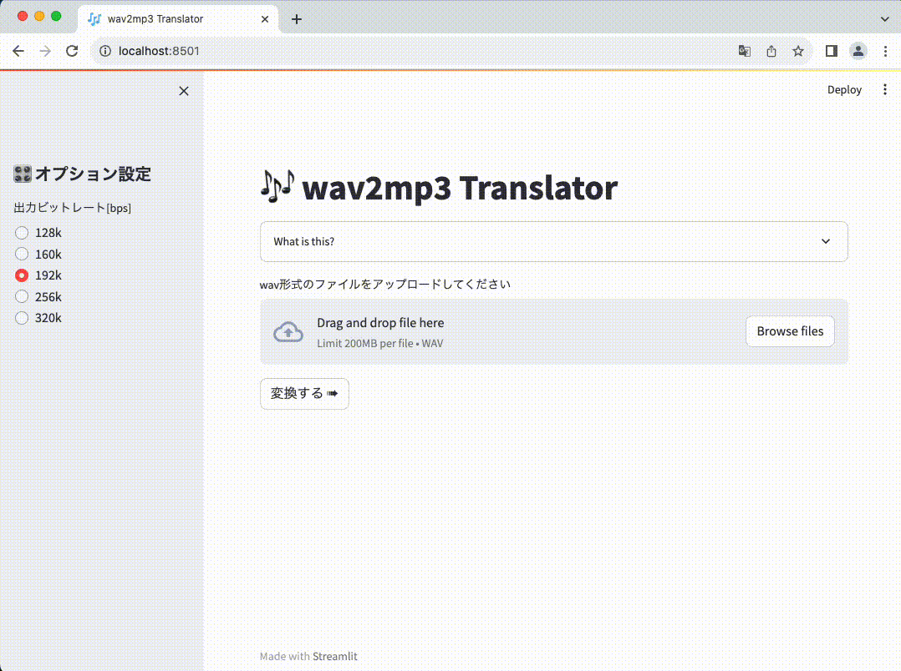

# wav2mp3 ツール

wav 形式の音声ファイルを mp3 に変換するツール



## Settings

環境設定方法

- 前提:
  - poetry がインストールされていること
- 環境準備:
  - 本リポジトリを git clone する
    ```
      $ git clone
      $ cd wav2mp3
    ```
  - ffmpeg のインストール
    ```
      $ brew install ffmpeg
    ```
  - パッケージ類のインストール
    ```
      $ poetry config virtualenvs.create false
      $ poetry use env use 3.9
      $ poetry install
    ```

## Run

アプリの起動方法

- ローカルでの起動方法
  ```
    $ cd apps
    $ poetry run streamlit run main.py
  ```
- Docker コンテナによる起動方法
  - TBW...

## License

MIT License

Copyright (c) 2023 Pu-of-Parari  
Released under the MIT license: https://opensource.org/licenses/mit-license.php
